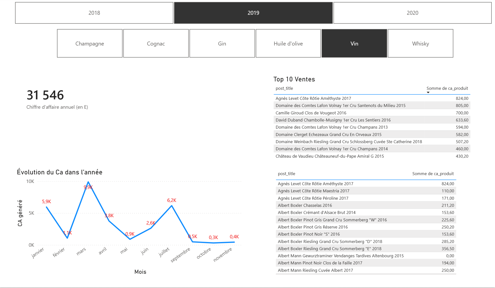
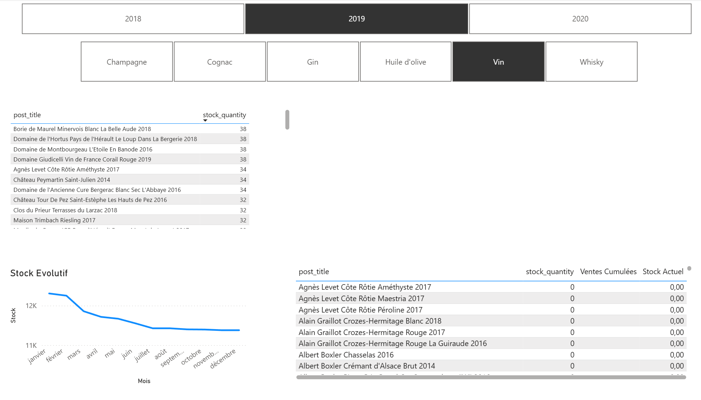

# 🍷 Pipeline d'Analyse Automatisé — Bottleneck

> **Pipeline ETL End-to-End** qui consolide les données ERP, Web et Liaison pour calculer le Chiffre d'Affaires, détecter les anomalies de prix, analyser les marges et générer des recommandations business actionnables.


---

## 📋 Table des Matières

1. [Vue d'ensemble](#-vue-densemble)
2. [Objectifs](#-objectifs)
3. [Stack technique](#-stack-technique)
4. [Architecture du projet](#-architecture-du-projet)
5. [Pipeline de données](#-pipeline-de-données)
6. [Analyses & Métriques](#-analyses--métriques)
7. [Insights clés](#-insights-clés)
8. [Recommandations](#-recommandations)
9. [Qualité & Industrialisation](#-qualité--industrialisation)
10. [Limites & Améliorations futures](#-limites--améliorations-futures)
11. [Livrables](#-livrables)
12. [Auteur](#-auteur)

---

## 🎯 Vue d'ensemble

**Contexte :** (Projet pédagogique, OpenClassrooms - parcours Data Analyst) — Bottleneck, une entreprise e-commerce spécialisée dans les vins et spiritueux, disposait de données dispersées entre un ERP, une plateforme web et une table de liaison. Cette fragmentation rendait difficile le suivi du Chiffre d'Affaires et l'optimisation des stocks et des prix.

**Problématique :** Comment consolider ces sources hétérogènes, calculer des indicateurs fiables de performance et identifier rapidement les leviers d'amélioration (produits sans ventes, anomalies de prix, marges, gestion des stocks) ?

**Approche :** Développement d'un pipeline Python modulaire (ETL), entièrement automatisé, connecté à une base MySQL, avec un dashboard Power BI pour le pilotage métier.

**Résultat :** Un pipeline industrialisé qui s'exécute quotidiennement, un dataset propre et exploitable, et des recommandations concrètes pour libérer de la trésorerie et optimiser la stratégie prix.

---

## 🏷️ Type de projet

| Type | Inclus |
|------|--------|
| 🔄 Data Pipeline / ETL | ✅ |
| 🧹 Data Cleaning / Wrangling | ✅ |
| 📊 Dashboard / Data Visualization | ✅ |
| 🏭 Industrialisation (tests, logs, automatisation) | ✅ |

---

## 🎯 Objectifs

- **Objectif principal :** Construire un pipeline ETL fiable et reproductible pour consolider les données de l'ERP et du site web
- **Objectif 2 :** Calculer le Chiffre d'Affaires global et par produit, analyser les marges et le stock dormant
- **Objectif 3 :** Détecter les produits atypiques (outliers prix via IQR et Z-score) et les produits sans ventes
- **Objectif 4 :** Industrialiser le processus (logging, tests unitaires, automatisation) et créer un dashboard Power BI décisionnel

---

## 🛠️ Stack Technique

| Catégorie | Outils |
|-----------|--------|
| **Traitement des données** | Python, Pandas, NumPy |
| **Base de données** | MySQL 8.x + SQLAlchemy |
| **Visualisation** | Matplotlib, Seaborn, Power BI |
| **Qualité & Tests** | pytest (12 tests unitaires), logging |
| **Automatisation** | Script `.bat` + Windows Task Scheduler |
| **Sécurité** | python-dotenv (variables d'environnement) |
| **Versioning** | Git / GitHub |

**Périmètre :** Données produit niveau SKU (prix, stock, ventes). Hors scope : prévisions, données client, marketing, temps réel.

---

## 🗂️ Architecture du Projet

```
bottleneck-etl-pipeline/
│
├── 📂 DATA/
│   ├── erp.csv                      ← Données produits (prix, stock, prix d'achat)
│   ├── web.csv                      ← Données ventes en ligne
│   ├── liaison.csv                  ← Table de correspondance ERP ↔ Web
│   └── dataset_final_propre.csv     ← Dataset enrichi (output)
│
├── 📂 OUTPUTS/                      ← Graphiques générés automatiquement
│   ├── analyse_prix_outliers.png
│   ├── boxplot_prix.png
│   ├── pareto_ca.png
│   ├── pareto_ventes.png
│   └── top5_stock_dormant.png
│
├── 📂 tests/                        ← 12 tests unitaires pytest
│   ├── test_extract.py
│   ├── test_transform.py
│   └── test_analyse.py
│
├── 📂 logs/                         ← Logs horodatés (1 fichier/jour)
│
├── extract.py                       ← Chargement multi-encodage CSV
├── transform.py                     ← Nettoyage & fusion des sources
├── analyse.py                       ← Analyses business & graphiques
├── database.py                      ← Export vers MySQL
├── logger.py                        ← Système de logging centralisé
├── main.py                          ← Orchestrateur du pipeline
├── run_pipeline.bat                 ← Lancement automatisé Windows
├── .env                             ← 🔒 Credentials (non versionné)
├── .gitignore
├── pytest.ini
└── requirements.txt
```

---

## 🔄 Pipeline de Données

```
┌─────────────────────────────────────────────────────────┐
│                     SOURCES DE DONNÉES                  │
│         erp.csv     web.csv     liaison.csv             │
└──────────────────────┬──────────────────────────────────┘
                       │
                       ▼
┌─────────────────────────────────────────────────────────┐
│                  EXTRACT (extract.py)                   │
│   Détection auto encodage (utf-8 / iso-8859-1)          │
│   Détection auto séparateur ( , / ; )                   │
└──────────────────────┬──────────────────────────────────┘
                       │
                       ▼
┌─────────────────────────────────────────────────────────┐
│                TRANSFORM (transform.py)                 │
│   Validation des colonnes requises                      │
│   Suppression doublons, conversion numérique            │
│   Correction virgules décimales (12,88 → 12.88)         │
│   Fusion ERP × Web × Liaison (inner join)               │
│   Correction stocks négatifs → 0                        │
└──────────────────────┬──────────────────────────────────┘
                       │
                       ▼
┌─────────────────────────────────────────────────────────┐
│                 ANALYSE (analyse.py)                    │
│   CA global & par produit                               │
│   Outliers IQR + Z-score                                │
│   Analyse de Pareto (CA & Quantités)                    │
│   Analyse des marges (top/flop rentabilité)             │
│   Couverture de stock (en mois)                         │
│   Génération de 5 graphiques                            │
└──────────────────────┬──────────────────────────────────┘
                       │
                       ▼
┌─────────────────────────────────────────────────────────┐
│                    LOAD (database.py)                   │
│   Export CSV  →  dataset_final_propre.csv               │
│   Export SQL  →  MySQL (table analyse_bottleneck)       │
│   Connexion Power BI  →  Dashboard décisionnel          │
└─────────────────────────────────────────────────────────┘
```

---

## 📊 Analyses & Métriques

| Métrique | Définition | Intérêt métier |
|----------|------------|----------------|
| **CA Total** | Prix × Ventes par produit | Performance globale |
| **CA par produit** | Contribution individuelle au revenu | Identification des produits phares |
| **Taux sans ventes** | % de références à 0 vente | Libération de trésorerie |
| **Outliers IQR** | Prix > Q3 + 1.5×IQR | Détection gamme Prestige |
| **Outliers Z-score** | Prix > μ + 3σ | Détection anomalies extrêmes |
| **Pareto CA** | % du catalogue → 80% du CA | Focus ressources commerciales |
| **Pareto Quantités** | % du catalogue → 80% des ventes | Gestion logistique |
| **Taux de marge** | (Prix - Prix achat) / Prix × 100 | Rentabilité par produit |
| **Mois de stock** | Stock / Ventes mensuelles | Risque d'immobilisation |

**Méthodes utilisées :** Nettoyage défensif, validation de schéma, statistiques IQR, Z-score, analyse de Pareto, visualisation multi-graphiques.

---

## 💡 Insights Clés

**Insight 1 — Concentration du CA**
11% du catalogue génère 80% du chiffre d'affaires. La stratégie commerciale doit se concentrer sur ces références phares plutôt que de diluer les efforts sur l'ensemble du catalogue.

**Insight 2 — Produits sans ventes**
3.5% des références n'ont réalisé aucune vente sur la période. Ces produits immobilisent du stock et de la trésorerie sans retour sur investissement.

**Insight 3 — Gamme Prestige détectée**
13 produits sont identifiés comme outliers prix (Z-score > 3), dont le Champagne Egly-Ouriet à 225€ et le Cognac Frapin VIP XO à 176€. Ces produits génèrent un CA significatif malgré un volume de ventes plus faible.

**Insight 4 — Stock dormant critique**
Certains champagnes haut de gamme affichent plus de 900 mois de couverture de stock, représentant une immobilisation de capital considérable à traiter en priorité.

**Insight 5 — Anomalie de marge détectée**
1 produit est identifié comme vendu à perte (taux de marge négatif). Très probablement une erreur de saisie dans l'ERP à corriger immédiatement.

---

## 📌 Recommandations

| Priorité | Recommandation | Basée sur | Responsable suggéré |
|----------|---------------|-----------|---------------------|
| 🔴 **Haute** | Corriger le produit vendu à perte (erreur ERP probable) | Insight 5 | Data Analyst / Contrôle de gestion |
| 🔴 **Haute** | Audit des produits sans ventes pour libérer la trésorerie | Insight 2 | Direction Supply Chain / Achats |
| 🟠 **Moyenne** | Renforcer le marketing sur la gamme Prestige sans baisser les prix | Insight 3 | Marketing / E-commerce |
| 🟠 **Moyenne** | Réduire le stock dormant des champagnes (900+ mois de couverture) | Insight 4 | Supply Chain |
| 🟡 **Basse** | Monitoring mensuel du taux de produits sans ventes | Insight 2 | Data Analyst / Opérations |

---

## 🏭 Qualité & Industrialisation

### Tests unitaires
```bash
python -m pytest tests/ -v
# 12 tests — 12 PASSED ✅
```

Couverture : `extract.py`, `transform.py`, `analyse.py` — validation des cas normaux et des cas limites (colonnes manquantes, valeurs nulles, doublons, prix non numériques).

### Logging
Chaque exécution génère un fichier de log horodaté dans `logs/` :
```
10:32:15 | INFO  | extract   | Succès (utf-8, séparateur ';')
10:32:16 | INFO  | transform | Fusion terminée : 714 lignes, 36 colonnes
10:32:17 | INFO  | analyse   | CA total : 153 748.10 €
10:32:18 | INFO  | database  | Données envoyées dans 'analyse_bottleneck'
```

### Sécurité
Les credentials MySQL sont stockés dans un fichier `.env` (non versionné) via `python-dotenv`.

### Automatisation
Le pipeline est planifié via Windows Task Scheduler pour une exécution quotidienne automatique via `run_pipeline.bat`.

---

## 🚀 Limites & Améliorations Futures

**Limitations actuelles :**
- Pas d'historique temporel (analyse sur une période fixe)
- Automatisation Windows uniquement
- Pas de données client ou de canal d'acquisition

**Améliorations prévues :**

| Amélioration | Impact |
|-------------|--------|
| Migration Cloud (BigQuery + Airflow) | Scalabilité et orchestration avancée |
| Dashboard web Streamlit | Accessibilité sans Power BI |
| Alertes automatiques (stock critique, marge négative) | Réactivité opérationnelle |
| Conteneurisation Docker | Portabilité et déploiement simplifié |
| Tests d'intégration end-to-end | Couverture qualité complète |

---

## 📦 Livrables

| Livrable | Description | Emplacement |
|----------|-------------|-------------|
| Pipeline Python | Code ETL complet modulaire | `/` |
| Dataset final | Données nettoyées et enrichies | `DATA/dataset_final_propre.csv` |
| Graphiques | 5 visuels d'analyse automatisés | `OUTPUTS/` |
| Dashboard Power BI | Visualisation interactive métier | `.pbix` |
| Tests unitaires | 12 tests pytest | `tests/` |
| Logs | Traçabilité horodatée | `logs/` |
| Automatisation | Planification quotidienne | `run_pipeline.bat` |

---

## 📊 Aperçu du Dashboard Power BI




---

## 🚀 Installation & Utilisation

1. **Cloner le dépôt :**
```bash
git clone https://github.com/KilianPauchet/bottleneck-etl-pipeline.git
cd bottleneck-etl-pipeline
```

2. **Installer les dépendances :**
```bash
pip install -r requirements.txt
```

3. **Configurer les variables d'environnement :**

Créer un fichier `.env` à la racine du projet :
```
DB_HOST=localhost
DB_PORT=3306
DB_NAME=bottleneck
DB_USER=ton_user
DB_PASSWORD=ton_password
```

4. **Créer la base de données MySQL :**
```sql
CREATE DATABASE bottleneck;
```

5. **Lancer le pipeline :**
```bash
python main.py
```

6. **(Optionnel) Automatisation quotidienne :**

Exécuter `run_pipeline.bat` via Windows Task Scheduler pour une exécution automatique.

> **Prérequis :** Python 3.13+, MySQL 8.x en cours d'exécution en local.

---

## 👤 Auteur

**Kilian Pauchet** — Data Analyst Junior

[](https://www.linkedin.com/in/kilianpauchet/)
[](https://github.com/KilianPauchet)
[](mailto:kilian.80520@gmail.com)

---

*Dernière mise à jour : Mai 2026*